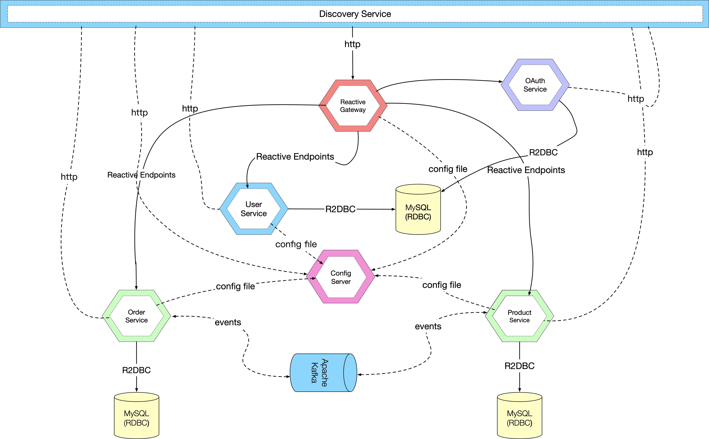

[TOC]

#  微服务系统设计

> “微服务就是一些协同工作的小而自治的服务，微服务很小，只专注做好一件事。一个微服务就是一个独立的实体，它可以独立的部署在`PAAS(Platform As A Service)`上，也可以作为一个操作系统进程存在。”

微服务具有很多不同的好处，其中很多好处也适用于任何一个分布式系统：**系统技术的异构性**，在一个由多个服务相互协作的系统中，可以在不同的服务中使用最适合该服务的技术。**提高系统的弹性**，弹性工程学的一个关键概念就是舱壁，如果系统中一个组件不可用了，但是并没有导致级联故障，那么系统的其它部分还可以正常运行。**系统易于扩展**，使用较小的多个服务，则可以只对需要扩展的服务进行扩展，这样就可以把那些不需要扩展的服务运行在更小的、性能稍差的硬件上。

## 服务整体设计图

服务之间的调用关系如下所示，服务结构图详细描述了从`Reactive Gateway`到具体服务及后端数据源`Datasource`之间的调用流程：`eureka-server`作为服务注册中心用于服务发现、`Reactive-gateway`作为微服务网关其对外提供统一访问入口，在网关层统一做request鉴权、请求分发、限流策略等。`config-server`为应用配置中心提供统一的配置管理功能，其从`github`指定仓库获取配置文件。`oauth-service`基于`spring cloud security`实现，其主要提供鉴权校验功能。

服务列表及所依赖`spring cloud`、`spring boot`版本信息如下：

| ServiceName     | Spring Boot    | Spring Cloud  | ORM   | Messaing     | Service Type         |
| --------------- | -------------- | ------------- | ----- | ------------ | -------------------- |
| eureka-server   | 2.1.12.RELEASE | Greenwich.SR5 | R2DBC | N/A          | netflix eureka       |
| api-gateway     | 2.1.12.RELEASE | Greenwich.SR5 | R2DBC | N/A          | spring cloud gateway |
| config-server   | 2.1.12.RELEASE | Greenwich.SR5 | N/A   | N/A          | config center        |
| oauth-service   | 2.1.12.RELEASE | Greenwich.SR5 | R2DBC | N/A          | spring cloud oauth   |
| order-service   | 2.1.12.RELEASE | Greenwich.SR5 | R2DBC | apache kafka | domain               |
| product-service | 2.1.12.RELEASE | Greenwich.SR5 | R2DBC | apache kafka | domain               |
| user-service    | 2.1.12.RELEASE | Greenwich.SR5 | R2DBC | N/A          | domain               |

### Api Gateway对外提供的接口列表：
-   **用户登陆接口**
    -   GET <http://localhost:8086/user/login/buyer?openid={0}>
-   **商家登陆接口**
    -   GET <http://localhost:8086/user/login/seller?openid={0}>
-   **获取产品列表接口**
    -   POST <http://localhost:8086/product/product/list>
-   **根据订单获取产品接口**
    -   POST <http://localhost:8086/product/product/list>
-   **根据产品id减库存接口**
    -   POST <http://localhost:8086/product/product/decreaseStock>
-   **创建订单接口**
    -   POST <http://localhost:8086/order/order/create
-   **完成订单接口**
    -   GET <http://localhost:8086/order/order/finish?orderId={0}>
-   **异步生成订单接口**
    -   POST <http://localhost:8086/order/decreaseStockAsync>

